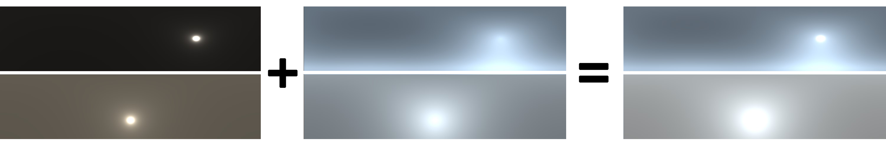

# Lalonde-Matthews Sky Model Renderer
A vectorized Python implementation of the Lalonde-Matthews parametric sky model compatible with NumPy and PyTorch.

*Two suns (first column) and skies (second column) created using the LM model: one clear (top row) and one cloudy (bottom row).*

The panoramas are linear RGB, HDR, and represented in the latitude-longitude format. The sun and sky panoramas are rendered separately and can be directly added afterward. Can be used to render parametric skies at arbitrary resolutions and train machine learning models for lighting-related tasks.

- **License:** Creative Commons Attribution Non-Commercial 4.0 International  (CC BY-NC 4.0)
- **For technical questions**, feel free to contact Lucas Valença (*lucas@valenca.io*).
- **For other inquiries**, please contact Prof. Jean-François Lalonde (jflalonde@gel.ulaval.ca).

If you use this code in your publication, feel free to cite it with the following BibTeX:

    @misc{lmskyrenderer,
          author = {Valen\c{c}a, Lucas and Zhang, Jinsong and Lalonde, Jean-Fran\c{c}ois},
          title = {Lalonde-Matthews Sky Model Renderer},
          howpublished = "\url{https://github.com/lvsn/lm-model}",
          year = {2023}
        }
As well as the [original Lalonde-Matthews paper](https://ieeexplore.ieee.org/abstract/document/7035818/) this implementation is based on:

    @inproceedings{lalonde2014lighting,
      title={Lighting estimation in outdoor image collections},
      author={Lalonde, Jean-Fran{\c{c}}ois and Matthews, Iain},
      booktitle={2014 2nd international conference on 3D vision},
      volume={1},
      pages={131--138},
      year={2014},
      organization={IEEE}
    }

## Dependencies
- NumPy
- PyTorch
- [Skylibs](https://github.com/soravux/skylibs)
- Matplotlib (for visualizing the example code only)

## Usage
A full working example can be found in `example.py`. Complete documentation is available at `lm_model.py`.

Example:

    lm = LMSkyModel(height=64, horizon_angle=90, device='cpu')

    sun = lm.get_sun(azimuth=0, zenith=np.pi/4, beta=5, kappa=1, wsun=[0.6, 0.52, 0.5])
    sky = lm.get_sky(azimuth=0, zenith=np.pi/4, turbidity=10, wsky=[0.38, 0.4, 0.75])
    sunsky = sun + sky

    tonemapped = np.clip((sunsky / np.percentile(sunsky, 97))**(1/2.2), 0, 1)

### Individual Panoramas
All parameters can be passed as individual float values, except for `wsun` and `wsky`, which can be 3-element lists, NumPy arrays, or PyTorch vectors. For PyTorch inputs, the output panoramas are PyTorch tensors of shape `(3, H, W)`, using the same device as the input tensors, where `W = 2H` (as per the latitude-logitude format) and `H` is given as input to the `LMSkyModel` object. For inputs consisting of lists and NumPy arrays, the resulting panoramas are `(H, W, 3)` NumPy arrays.

### Multiple Panoramas in Parallel
The same logic applies as to generating individual panoramas, except scalars can be passed as lists, 1D NumPy arrays, or PyTorch Tensors with `N` elements. For the RGB triplets `wsun` and `wsky`, the format should be `Nx3` matrices. The output panoramas will be shaped  `(N, 3, H, W)` and `(N, H, W, 3)` for PyTorch and NumPy, respectively.
